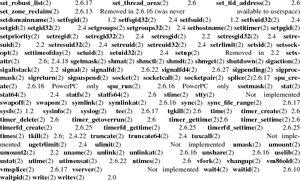

<!-- Creator     : groff version 1.18.1.4 -->
<!-- CreationDate: Tue Nov  3 20:11:00 2015 -->
<html>
<head>
<meta name="generator" content="groff -Thtml, see www.gnu.org">
<meta name="Content-Style" content="text/css">
<title>SYSCALLS</title>
</head>
<body>

<h1 align=center>SYSCALLS</h1>
<a href="#NAME">NAME</a> 
<a href="#SYNOPSIS">SYNOPSIS</a> 
<a href="#DESCRIPTION">DESCRIPTION</a> 
<a href="#NOTES">NOTES</a> 
<a href="#SEE ALSO">SEE ALSO</a> 
<a href="#COLOPHON">COLOPHON</a> 

<h2>NAME</h2>
<!-- INDENTATION -->
<table width="100%" border=0 rules="none" frame="void"
       cols="2" cellspacing="0" cellpadding="0">
<tr valign="top" align="left">
<td width="10%"></td>
<td width="89%">

syscalls &minus; Linux system calls

</td>
</table>

<h2>SYNOPSIS</h2>
<!-- INDENTATION -->
<table width="100%" border=0 rules="none" frame="void"
       cols="2" cellspacing="0" cellpadding="0">
<tr valign="top" align="left">
<td width="10%"></td>
<td width="89%">

Linux system calls.

</td>
</table>

<h2>DESCRIPTION</h2>
<!-- INDENTATION -->
<table width="100%" border=0 rules="none" frame="void"
       cols="2" cellspacing="0" cellpadding="0">
<tr valign="top" align="left">
<td width="10%"></td>
<td width="89%">

The system call is the fundamental interface between an
application and the Linux kernel.

</td>
</table>
<!-- INDENTATION -->
<table width="100%" border=0 rules="none" frame="void"
       cols="2" cellspacing="0" cellpadding="0">
<tr valign="top" align="left">
<td width="4%"></td>
<td width="95%">

<b>System calls and library wrapper
functions</b>
</td>
</table>
<!-- INDENTATION -->
<table width="100%" border=0 rules="none" frame="void"
       cols="2" cellspacing="0" cellpadding="0">
<tr valign="top" align="left">
<td width="10%"></td>
<td width="89%">

System calls are generally not invoked directly, but
rather via wrapper functions in glibc (or perhaps some other
library). For details of direct invocation of a system call,
see <b>intro</b>(2). Often, but not always, the name of the
wrapper function is the same as the name of the system call
that it invokes. For example, glibc contains a function
<b>truncate</b>() which invokes the underlying
&quot;truncate&quot; system call.

<!-- INDENTATION -->

Often the glibc wrapper function is quite thin, doing
little work other than copying arguments to the right
registers before invoking the system call, and then setting
<i>errno</i> appropriately after the system call has
returned. (These are the same steps that are performed by
<b>syscall</b>(2), which can be used to invoke system calls
for which no wrapper function is provided.) Note: system
calls indicate a failure by returning a negative error
number to the caller; when this happens, the wrapper
function negates the returned error number (to make it
positive), copies it to <i>errno</i>, and returns &minus;1
to the caller of the wrapper.

<!-- INDENTATION -->

Sometimes, however, the wrapper function does some extra
work before invoking the system call. For example, nowadays
there are (for reasons described below) two related system
calls, <b>truncate</b>(2) and <b>truncate64</b>(2), and the
glibc <b>truncate</b>() wrapper function checks which of
those system calls are provided by the kernel and determines
which should be employed.

</td>
</table>
<!-- INDENTATION -->
<table width="100%" border=0 rules="none" frame="void"
       cols="2" cellspacing="0" cellpadding="0">
<tr valign="top" align="left">
<td width="4%"></td>
<td width="95%">

<b>System call list</b>
</td>
</table>
<!-- INDENTATION -->
<table width="100%" border=0 rules="none" frame="void"
       cols="2" cellspacing="0" cellpadding="0">
<tr valign="top" align="left">
<td width="10%"></td>
<td width="89%">

Below is a list of those system calls that are common to
most platforms. In the list, the <i>Kernel</i> column
indicates the kernel version for those system calls that
were new in Linux 2.2, or have appeared since that kernel
version. Note the following points:

</td>
</table>
<!-- TABS -->
<table width="100%" border=0 rules="none" frame="void"
       cols="4" cellspacing="0" cellpadding="0">
<tr valign="top" align="left">
<td width="11%"></td>
<td width="2%">

*

</td>
<td width="1%"></td>
<td width="83%">

Where no kernel version is indicated, the system call
appeared in kernel 1.0 or earlier.

</td>
<tr valign="top" align="left">
<td width="11%"></td>
<td width="2%">

*

</td>
<td width="1%"></td>
<td width="83%">

Where a system call is marked &quot;1.2&quot; this means
the system call probably appeared in a 1.1.x kernel version,
and first appeared in a stable kernel with 1.2. (Development
of the 1.2 kernel was initiated from a branch of kernel
1.0.6 via the 1.1.x unstable kernel series.)

</td>
<tr valign="top" align="left">
<td width="11%"></td>
<td width="2%">

*

</td>
<td width="1%"></td>
<td width="83%">

Where a system call is marked &quot;2.0&quot; this means
the system call probably appeared in a 1.3.x kernel version,
and first appeared in a stable kernel with 2.0. (Development
of the 2.0 kernel was initiated from a branch of kernel
1.2.x, somewhere around 1.2.10, via the 1.3.x unstable
kernel series.)

</td>
<tr valign="top" align="left">
<td width="11%"></td>
<td width="2%">

*

</td>
<td width="1%"></td>
<td width="83%">

Where a system call is marked &quot;2.2&quot; this means
the system call probably appeared in a 2.1.x kernel version,
and first appeared in a stable kernel with 2.2.0.
(Development of the 2.2 kernel was initiated from a branch
of kernel 2.0.21 via the 2.1.x unstable kernel series.)

</td>
<tr valign="top" align="left">
<td width="11%"></td>
<td width="2%">

*

</td>
<td width="1%"></td>
<td width="83%">

Where a system call is marked &quot;2.4&quot; this means
the system call probably appeared in a 2.3.x kernel version,
and first appeared in a stable kernel with 2.4.0.
(Development of the 2.4 kernel was initiated from a branch
of kernel 2.2.8 via the 2.3.x unstable kernel series.)

</td>
<tr valign="top" align="left">
<td width="11%"></td>
<td width="2%">

*

</td>
<td width="1%"></td>
<td width="83%">

Where a system call is marked &quot;2.6&quot; this means
the system call probably appeared in a 2.5.x kernel version,
and first appeared in a stable kernel with 2.6.0.
(Development of kernel 2.6 was initiated from a branch of
kernel 2.4.15 via the 2.5.x unstable kernel series.)

</td>
<tr valign="top" align="left">
<td width="11%"></td>
<td width="2%">

*

</td>
<td width="1%"></td>
<td width="83%">

Starting with kernel 2.6.0, the development model
changed, and new system calls may appear in each 2.6.x
release. In this case, the exact version number where the
system call appeared is shown.

</td>
<tr valign="top" align="left">
<td width="11%"></td>
<td width="2%">

*

</td>
<td width="1%"></td>
<td width="83%">

In some cases, a system call was added to a stable
kernel series after it branched from the previous stable
kernel series, and then backported into the earlier stable
kernel series. For example some system calls that appeared
in 2.6.x were also backported into a 2.4.x release after
2.4.15. When this is so, the version where the system call
appeared in both of the major kernel series is listed.

</td>
</table>
<!-- INDENTATION -->
<table width="100%" border=0 rules="none" frame="void"
       cols="2" cellspacing="0" cellpadding="0">
<tr valign="top" align="left">
<td width="10%"></td>
<td width="89%">

The list of system calls that are available as at kernel
2.6.28 (or in a few cases only on older kernels) is as
follows:
</td>
</table>
<!-- TABS -->
<table width="100%" border=0 rules="none" frame="void"
       cols="12" cellspacing="0" cellpadding="0">
<tr valign="top" align="left">
<td width="17%"></td>
<td width="7%"></td>
<td width="7%"></td>
<td width="7%">
</td>
<td width="7%"></td>
<td width="7%">
</td>
<td width="7%"></td>
<td width="7%"></td>
<td width="14%"></td>
<td width="7%"></td>
<td width="7%"></td>
<td width="1%">
</td>
<tr valign="top" align="left">
<td width="17%"></td>
<td width="7%"></td>
<td width="7%"></td>
<td width="7%">
</td>
<td width="7%"></td>
<td width="7%"></td>
<td width="7%"></td>
<td width="7%"></td>
<td width="14%"></td>
<td width="7%"></td>
<td width="7%"></td>
<td width="1%">
</td>
<tr valign="top" align="left">
<td width="17%"></td>
<td width="7%"></td>
<td width="7%"></td>
<td width="7%">
</td>
<td width="7%"></td>
<td width="7%"></td>
<td width="7%"></td>
<td width="7%"></td>
<td width="14%"></td>
<td width="7%"></td>
<td width="7%"></td>
<td width="1%">
</td>
<tr valign="top" align="left">
<td width="17%"></td>
<td width="7%"></td>
<td width="7%"></td>
<td width="7%">
</td>
<td width="7%"></td>
<td width="7%"></td>
<td width="7%"></td>
<td width="7%"></td>
<td width="14%"></td>
<td width="7%"></td>
<td width="7%"></td>
<td width="1%">
</td>
<tr valign="top" align="left">
<td width="17%"></td>
<td width="7%"></td>
<td width="7%"></td>
<td width="7%">
</td>
<td width="7%">
</td>
<td width="7%"></td>
<td width="7%"></td>
<td width="7%"></td>
<td width="14%"></td>
<td width="7%"></td>
<td width="7%"></td>
<td width="1%">
</td>
<tr valign="top" align="left">
<td width="17%"></td>
<td width="7%"></td>
<td width="7%"></td>
<td width="7%"></td>
<td width="7%">
</td>
<td width="7%"></td>
<td width="7%">
</td>
<td width="7%"></td>
<td width="14%"></td>
<td width="7%"></td>
<td width="7%"></td>
<td width="1%">
</td>
<tr valign="top" align="left">
<td width="17%"></td>
<td width="7%"></td>
<td width="7%"></td>
<td width="7%">
</td>
<td width="7%">
</td>
<td width="7%"></td>
<td width="7%"></td>
<td width="7%"></td>
<td width="14%"></td>
<td width="7%"></td>
<td width="7%"></td>
<td width="1%">
</td>
<tr valign="top" align="left">
<td width="17%"></td>
<td width="7%"></td>
<td width="7%">
</td>
<td width="7%">
</td>
<td width="7%"></td>
<td width="7%"></td>
<td width="7%"></td>
<td width="7%"></td>
<td width="14%"></td>
<td width="7%"></td>
<td width="7%"></td>
<td width="1%">
</td>
<tr valign="top" align="left">
<td width="17%"></td>
<td width="7%"></td>
<td width="7%"></td>
<td width="7%">
</td>
<td width="7%">
</td>
<td width="7%"></td>
<td width="7%"></td>
<td width="7%"></td>
<td width="14%"></td>
<td width="7%"></td>
<td width="7%"></td>
<td width="1%">
</td>
<tr valign="top" align="left">
<td width="17%"></td>
<td width="7%"></td>
<td width="7%">
</td>
<td width="7%"></td>
<td width="7%"></td>
<td width="7%"></td>
<td width="7%"></td>
<td width="7%"></td>
<td width="14%"></td>
<td width="7%"></td>
<td width="7%"></td>
<td width="1%">
</td>
<tr valign="top" align="left">
<td width="17%"></td>
<td width="7%"></td>
<td width="7%">
</td>
<td width="7%">
</td>
<td width="7%">
</td>
<td width="7%"></td>
<td width="7%"></td>
<td width="7%"></td>
<td width="14%"></td>
<td width="7%"></td>
<td width="7%"></td>
<td width="1%">
</td>
<tr valign="top" align="left">
<td width="17%"></td>
<td width="7%"></td>
<td width="7%"></td>
<td width="7%"></td>
<td width="7%">
</td>
<td width="7%"></td>
<td width="7%"></td>
<td width="7%"></td>
<td width="14%"></td>
<td width="7%"></td>
<td width="7%"></td>
<td width="1%">
</td>
<tr valign="top" align="left">
<td width="17%"></td>
<td width="7%"></td>
<td width="7%"></td>
<td width="7%"></td>
<td width="7%">
</td>
<td width="7%"></td>
<td width="7%"></td>
<td width="7%"></td>
<td width="14%"></td>
<td width="7%"></td>
<td width="7%"></td>
<td width="1%">
</td>
<tr valign="top" align="left">
<td width="17%"></td>
<td width="7%"></td>
<td width="7%"></td>
<td width="7%"></td>
<td width="7%">
</td>
<td width="7%"></td>
<td width="7%"></td>
<td width="7%"></td>
<td width="14%"></td>
<td width="7%"></td>
<td width="7%"></td>
<td width="1%">
</td>
<tr valign="top" align="left">
<td width="17%"></td>
<td width="7%"></td>
<td width="7%">
</td>
<td width="7%"></td>
<td width="7%">
</td>
<td width="7%"></td>
<td width="7%"></td>
<td width="7%"></td>
<td width="14%"></td>
<td width="7%"></td>
<td width="7%"></td>
<td width="1%">
</td>
<tr valign="top" align="left">
<td width="17%"></td>
<td width="7%"></td>
<td width="7%"></td>
<td width="7%"></td>
<td width="7%">
</td>
<td width="7%"></td>
<td width="7%"></td>
<td width="7%"></td>
<td width="14%"></td>
<td width="7%"></td>
<td width="7%"></td>
<td width="1%">
</td>
<tr valign="top" align="left">
<td width="17%"></td>
<td width="7%"></td>
<td width="7%"></td>
<td width="7%">
</td>
<td width="7%"></td>
<td width="7%"></td>
<td width="7%"></td>
<td width="7%"></td>
<td width="14%"></td>
<td width="7%"></td>
<td width="7%"></td>
<td width="1%">
</td>
<tr valign="top" align="left">
<td width="17%"></td>
<td width="7%"></td>
<td width="7%"></td>
<td width="7%">
</td>
<td width="7%"></td>
<td width="7%"></td>
<td width="7%"></td>
<td width="7%"></td>
<td width="14%"></td>
<td width="7%"></td>
<td width="7%"></td>
<td width="1%">
</td>
<tr valign="top" align="left">
<td width="17%"></td>
<td width="7%"></td>
<td width="7%"></td>
<td width="7%">
</td>
<td width="7%"></td>
<td width="7%"></td>
<td width="7%"></td>
<td width="7%"></td>
<td width="14%"></td>
<td width="7%"></td>
<td width="7%"></td>
<td width="1%">
</td>
<tr valign="top" align="left">
<td width="17%"></td>
<td width="7%"></td>
<td width="7%"></td>
<td width="7%">
</td>
<td width="7%"></td>
<td width="7%"></td>
<td width="7%"></td>
<td width="7%"></td>
<td width="14%"></td>
<td width="7%"></td>
<td width="7%"></td>
<td width="1%">
</td>
<tr valign="top" align="left">
<td width="17%"></td>
<td width="7%"></td>
<td width="7%"></td>
<td width="7%">
</td>
<td width="7%"></td>
<td width="7%"></td>
<td width="7%"></td>
<td width="7%"></td>
<td width="14%"></td>
<td width="7%"></td>
<td width="7%"></td>
<td width="1%">
</td>
<tr valign="top" align="left">
<td width="17%"></td>
<td width="7%"></td>
<td width="7%"></td>
<td width="7%">
</td>
<td width="7%"></td>
<td width="7%"></td>
<td width="7%"></td>
<td width="7%"></td>
<td width="14%"></td>
<td width="7%"></td>
<td width="7%"></td>
<td width="1%">
</td>
<tr valign="top" align="left">
<td width="17%"></td>
<td width="7%"></td>
<td width="7%"></td>
<td width="7%">
</td>
<td width="7%"></td>
<td width="7%"></td>
<td width="7%"></td>
<td width="7%"></td>
<td width="14%"></td>
<td width="7%"></td>
<td width="7%"></td>
<td width="1%">
</td>
<tr valign="top" align="left">
<td width="17%"></td>
<td width="7%"></td>
<td width="7%"></td>
<td width="7%">
</td>
<td width="7%">
</td>
<td width="7%"></td>
<td width="7%"></td>
<td width="7%"></td>
<td width="14%"></td>
<td width="7%"></td>
<td width="7%"></td>
<td width="1%">
</td>
<tr valign="top" align="left">
<td width="17%"></td>
<td width="7%"></td>
<td width="7%"></td>
<td width="7%">
</td>
<td width="7%"></td>
<td width="7%"></td>
<td width="7%"></td>
<td width="7%"></td>
<td width="14%"></td>
<td width="7%"></td>
<td width="7%"></td>
<td width="1%">
</td>
<tr valign="top" align="left">
<td width="17%"></td>
<td width="7%"></td>
<td width="7%"></td>
<td width="7%">
</td>
<td width="7%"></td>
<td width="7%"></td>
<td width="7%"></td>
<td width="7%"></td>
<td width="14%"></td>
<td width="7%"></td>
<td width="7%"></td>
<td width="1%">
</td>
<tr valign="top" align="left">
<td width="17%"></td>
<td width="7%"></td>
<td width="7%"></td>
<td width="7%">
</td>
<td width="7%"></td>
<td width="7%"></td>
<td width="7%"></td>
<td width="7%"></td>
<td width="14%"></td>
<td width="7%"></td>
<td width="7%"></td>
<td width="1%">
</td>
<tr valign="top" align="left">
<td width="17%"></td>
<td width="7%"></td>
<td width="7%"></td>
<td width="7%">
</td>
<td width="7%"></td>
<td width="7%"></td>
<td width="7%"></td>
<td width="7%"></td>
<td width="14%"></td>
<td width="7%"></td>
<td width="7%"></td>
<td width="1%">
</td>
<tr valign="top" align="left">
<td width="17%"></td>
<td width="7%"></td>
<td width="7%"></td>
<td width="7%">
</td>
<td width="7%"></td>
<td width="7%"></td>
<td width="7%"></td>
<td width="7%"></td>
<td width="14%"></td>
<td width="7%"></td>
<td width="7%"></td>
<td width="1%">
</td>
<tr valign="top" align="left">
<td width="17%"></td>
<td width="7%"></td>
<td width="7%"></td>
<td width="7%">
</td>
<td width="7%"></td>
<td width="7%"></td>
<td width="7%"></td>
<td width="7%"></td>
<td width="14%"></td>
<td width="7%"></td>
<td width="7%"></td>
<td width="1%">
</td>
<tr valign="top" align="left">
<td width="17%"></td>
<td width="7%"></td>
<td width="7%"></td>
<td width="7%">
</td>
<td width="7%"></td>
<td width="7%"></td>
<td width="7%"></td>
<td width="7%"></td>
<td width="14%"></td>
<td width="7%"></td>
<td width="7%"></td>
<td width="1%">
</td>
<tr valign="top" align="left">
<td width="17%"></td>
<td width="7%"></td>
<td width="7%">
</td>
<td width="7%"></td>
<td width="7%">
</td>
<td width="7%"></td>
<td width="7%">
</td>
<td width="7%"></td>
<td width="14%"></td>
<td width="7%"></td>
<td width="7%"></td>
<td width="1%">
</td>
<tr valign="top" align="left">
<td width="17%"></td>
<td width="7%"></td>
<td width="7%"></td>
<td width="7%"></td>
<td width="7%">
</td>
<td width="7%"></td>
<td width="7%"></td>
<td width="7%"></td>
<td width="14%"></td>
<td width="7%"></td>
<td width="7%"></td>
<td width="1%">
</td>
<tr valign="top" align="left">
<td width="17%"></td>
<td width="7%"></td>
<td width="7%"></td>
<td width="7%">
</td>
<td width="7%"></td>
<td width="7%"></td>
<td width="7%"></td>
<td width="7%"></td>
<td width="14%"></td>
<td width="7%"></td>
<td width="7%"></td>
<td width="1%">
</td>
<tr valign="top" align="left">
<td width="17%"></td>
<td width="7%"></td>
<td width="7%"></td>
<td width="7%">
</td>
<td width="7%"></td>
<td width="7%"></td>
<td width="7%"></td>
<td width="7%"></td>
<td width="14%"></td>
<td width="7%"></td>
<td width="7%"></td>
<td width="1%">
</td>
<tr valign="top" align="left">
<td width="17%"></td>
<td width="7%"></td>
<td width="7%"></td>
<td width="7%">
</td>
<td width="7%"></td>
<td width="7%"></td>
<td width="7%"></td>
<td width="7%"></td>
<td width="14%"></td>
<td width="7%"></td>
<td width="7%"></td>
<td width="1%">
</td>
<tr valign="top" align="left">
<td width="17%"></td>
<td width="7%"></td>
<td width="7%"></td>
<td width="7%">
</td>
<td width="7%"></td>
<td width="7%"></td>
<td width="7%"></td>
<td width="7%"></td>
<td width="14%"></td>
<td width="7%"></td>
<td width="7%"></td>
<td width="1%">
</td>
<tr valign="top" align="left">
<td width="17%"></td>
<td width="7%"></td>
<td width="7%">
</td>
<td width="7%">
</td>
<td width="7%"></td>
<td width="7%"></td>
<td width="7%"></td>
<td width="7%"></td>
<td width="14%"></td>
<td width="7%"></td>
<td width="7%"></td>
<td width="1%">
</td>
<tr valign="top" align="left">
<td width="17%"></td>
<td width="7%"></td>
<td width="7%"></td>
<td width="7%">
</td>
<td width="7%"></td>
<td width="7%"></td>
<td width="7%"></td>
<td width="7%"></td>
<td width="14%"></td>
<td width="7%"></td>
<td width="7%"></td>
<td width="1%">
</td>
<tr valign="top" align="left">
<td width="17%"></td>
<td width="7%"></td>
<td width="7%">
</td>
<td width="7%">
</td>
<td width="7%">
</td>
<td width="7%"></td>
<td width="7%"></td>
<td width="7%"></td>
<td width="14%"></td>
<td width="7%"></td>
<td width="7%"></td>
<td width="1%">
</td>
<tr valign="top" align="left">
<td width="17%"></td>
<td width="7%"></td>
<td width="7%"></td>
<td width="7%"></td>
<td width="7%">
</td>
<td width="7%"></td>
<td width="7%"></td>
<td width="7%"></td>
<td width="14%"></td>
<td width="7%"></td>
<td width="7%"></td>
<td width="1%">
</td>
<tr valign="top" align="left">
<td width="17%"></td>
<td width="7%"></td>
<td width="7%"></td>
<td width="7%"></td>
<td width="7%">
</td>
<td width="7%"></td>
<td width="7%"></td>
<td width="7%"></td>
<td width="14%"></td>
<td width="7%"></td>
<td width="7%"></td>
<td width="1%">
</td>
<tr valign="top" align="left">
<td width="17%"></td>
<td width="7%"></td>
<td width="7%">
</td>
<td width="7%"></td>
<td width="7%"></td>
<td width="7%"></td>
<td width="7%"></td>
<td width="7%"></td>
<td width="14%"></td>
<td width="7%"></td>
<td width="7%"></td>
<td width="1%">
</td>
<tr valign="top" align="left">
<td width="17%"></td>
<td width="7%"></td>
<td width="7%">
</td>
<td width="7%">
</td>
<td width="7%"></td>
<td width="7%"></td>
<td width="7%"></td>
<td width="7%"></td>
<td width="14%"></td>
<td width="7%"></td>
<td width="7%"></td>
<td width="1%">
</td>
<tr valign="top" align="left">
<td width="17%"></td>
<td width="7%"></td>
<td width="7%"></td>
<td width="7%">
</td>
<td width="7%"></td>
<td width="7%"></td>
<td width="7%"></td>
<td width="7%"></td>
<td width="14%"></td>
<td width="7%"></td>
<td width="7%"></td>
<td width="1%">
</td>
<tr valign="top" align="left">
<td width="17%"></td>
<td width="7%"></td>
<td width="7%"></td>
<td width="7%">
</td>
<td width="7%"></td>
<td width="7%"></td>
<td width="7%"></td>
<td width="7%"></td>
<td width="14%"></td>
<td width="7%"></td>
<td width="7%"></td>
<td width="1%">
</td>
<tr valign="top" align="left">
<td width="17%"></td>
<td width="7%"></td>
<td width="7%"></td>
<td width="7%">
</td>
<td width="7%"></td>
<td width="7%"></td>
<td width="7%"></td>
<td width="7%"></td>
<td width="14%"></td>
<td width="7%"></td>
<td width="7%"></td>
<td width="1%">
</td>
<tr valign="top" align="left">
<td width="17%"></td>
<td width="7%"></td>
<td width="7%"></td>
<td width="7%">
</td>
<td width="7%"></td>
<td width="7%"></td>
<td width="7%"></td>
<td width="7%"></td>
<td width="14%"></td>
<td width="7%"></td>
<td width="7%"></td>
<td width="1%">
</td>
<tr valign="top" align="left">
<td width="17%"></td>
<td width="7%"></td>
<td width="7%"></td>
<td width="7%">
</td>
<td width="7%"></td>
<td width="7%"></td>
<td width="7%"></td>
<td width="7%"></td>
<td width="14%"></td>
<td width="7%"></td>
<td width="7%"></td>
<td width="1%">
</td>
<tr valign="top" align="left">
<td width="17%"></td>
<td width="7%"></td>
<td width="7%"></td>
<td width="7%">
</td>
<td width="7%">
</td>
<td width="7%"></td>
<td width="7%"></td>
<td width="7%"></td>
<td width="14%"></td>
<td width="7%"></td>
<td width="7%"></td>
<td width="1%">
</td>
<tr valign="top" align="left">
<td width="17%"></td>
<td width="7%"></td>
<td width="7%"></td>
<td width="7%">
</td>
<td width="7%">
</td>
<td width="7%"></td>
<td width="7%"></td>
<td width="7%"></td>
<td width="14%"></td>
<td width="7%"></td>
<td width="7%"></td>
<td width="1%">
</td>
<tr valign="top" align="left">
<td width="17%"></td>
<td width="7%"></td>
<td width="7%"></td>
<td width="7%">
</td>
<td width="7%"></td>
<td width="7%"></td>
<td width="7%"></td>
<td width="7%"></td>
<td width="14%"></td>
<td width="7%"></td>
<td width="7%"></td>
<td width="1%">
</td>
<tr valign="top" align="left">
<td width="17%"></td>
<td width="7%"></td>
<td width="7%"></td>
<td width="7%">
</td>
<td width="7%"></td>
<td width="7%"></td>
<td width="7%"></td>
<td width="7%"></td>
<td width="14%"></td>
<td width="7%"></td>
<td width="7%"></td>
<td width="1%">
</td>
<tr valign="top" align="left">
<td width="17%"></td>
<td width="7%"></td>
<td width="7%"></td>
<td width="7%">
</td>
<td width="7%"></td>
<td width="7%"></td>
<td width="7%"></td>
<td width="7%"></td>
<td width="14%"></td>
<td width="7%"></td>
<td width="7%"></td>
<td width="1%">
</td>
<tr valign="top" align="left">
<td width="17%"></td>
<td width="7%"></td>
<td width="7%"></td>
<td width="7%">
</td>
<td width="7%"></td>
<td width="7%"></td>
<td width="7%"></td>
<td width="7%"></td>
<td width="14%"></td>
<td width="7%"></td>
<td width="7%"></td>
<td width="1%">
</td>
<tr valign="top" align="left">
<td width="17%"></td>
<td width="7%"></td>
<td width="7%">
</td>
<td width="7%"></td>
<td width="7%"></td>
<td width="7%"></td>
<td width="7%"></td>
<td width="7%"></td>
<td width="14%"></td>
<td width="7%"></td>
<td width="7%"></td>
<td width="1%">
</td>
<tr valign="top" align="left">
<td width="17%"></td>
<td width="7%"></td>
<td width="7%">
</td>
<td width="7%">
</td>
<td width="7%"></td>
<td width="7%"></td>
<td width="7%"></td>
<td width="7%"></td>
<td width="14%"></td>
<td width="7%"></td>
<td width="7%"></td>
<td width="1%">
</td>
<tr valign="top" align="left">
<td width="17%"></td>
<td width="7%"></td>
<td width="7%"></td>
<td width="7%">
</td>
<td width="7%"></td>
<td width="7%"></td>
<td width="7%"></td>
<td width="7%"></td>
<td width="14%"></td>
<td width="7%"></td>
<td width="7%"></td>
<td width="1%">
</td>
<tr valign="top" align="left">
<td width="17%"></td>
<td width="7%"></td>
<td width="7%">
</td>
<td width="7%">
</td>
<td width="7%"></td>
<td width="7%"></td>
<td width="7%"></td>
<td width="7%"></td>
<td width="14%"></td>
<td width="7%"></td>
<td width="7%"></td>
<td width="1%">
</td>
<tr valign="top" align="left">
<td width="17%"></td>
<td width="7%"></td>
<td width="7%">
</td>
<td width="7%">
</td>
<td width="7%"></td>
<td width="7%">
</td>
<td width="7%"></td>
<td width="7%"></td>
<td width="14%"></td>
<td width="7%"></td>
<td width="7%"></td>
<td width="1%">
</td>
<tr valign="top" align="left">
<td width="17%"></td>
<td width="7%"></td>
<td width="7%"></td>
<td width="7%"></td>
<td width="7%">
</td>
<td width="7%"></td>
<td width="7%"></td>
<td width="7%"></td>
<td width="14%"></td>
<td width="7%"></td>
<td width="7%"></td>
<td width="1%">
</td>
<tr valign="top" align="left">
<td width="17%"></td>
<td width="7%"></td>
<td width="7%"></td>
<td width="7%"></td>
<td width="7%">
</td>
<td width="7%"></td>
<td width="7%"></td>
<td width="7%"></td>
<td width="14%"></td>
<td width="7%"></td>
<td width="7%"></td>
<td width="1%">
</td>
<tr valign="top" align="left">
<td width="17%"></td>
<td width="7%"></td>
<td width="7%"></td>
<td width="7%"></td>
<td width="7%">
</td>
<td width="7%"></td>
<td width="7%"></td>
<td width="7%"></td>
<td width="14%"></td>
<td width="7%"></td>
<td width="7%"></td>
<td width="1%">
</td>
<tr valign="top" align="left">
<td width="17%"></td>
<td width="7%"></td>
<td width="7%"></td>
<td width="7%">
</td>
<td width="7%"></td>
<td width="7%"></td>
<td width="7%"></td>
<td width="7%"></td>
<td width="14%"></td>
<td width="7%"></td>
<td width="7%"></td>
<td width="1%">
</td>
<tr valign="top" align="left">
<td width="17%"></td>
<td width="7%"></td>
<td width="7%"></td>
<td width="7%">
</td>
<td width="7%">
</td>
<td width="7%"></td>
<td width="7%"></td>
<td width="7%"></td>
<td width="14%"></td>
<td width="7%"></td>
<td width="7%"></td>
<td width="1%">
</td>
<tr valign="top" align="left">
<td width="17%"></td>
<td width="7%"></td>
<td width="7%"></td>
<td width="7%">
</td>
<td width="7%"></td>
<td width="7%"></td>
<td width="7%"></td>
<td width="7%"></td>
<td width="14%"></td>
<td width="7%"></td>
<td width="7%"></td>
<td width="1%">
</td>
<tr valign="top" align="left">
<td width="17%"></td>
<td width="7%"></td>
<td width="7%"></td>
<td width="7%">
</td>
<td width="7%"></td>
<td width="7%"></td>
<td width="7%"></td>
<td width="7%"></td>
<td width="14%"></td>
<td width="7%"></td>
<td width="7%"></td>
<td width="1%">
</td>
<tr valign="top" align="left">
<td width="17%"></td>
<td width="7%"></td>
<td width="7%"></td>
<td width="7%">
</td>
<td width="7%"></td>
<td width="7%"></td>
<td width="7%"></td>
<td width="7%"></td>
<td width="14%"></td>
<td width="7%"></td>
<td width="7%"></td>
<td width="1%">
</td>
<tr valign="top" align="left">
<td width="17%"></td>
<td width="7%"></td>
<td width="7%"></td>
<td width="7%">
</td>
<td width="7%"></td>
<td width="7%"></td>
<td width="7%"></td>
<td width="7%"></td>
<td width="14%"></td>
<td width="7%"></td>
<td width="7%"></td>
<td width="1%">
</td>
<tr valign="top" align="left">
<td width="17%"></td>
<td width="7%"></td>
<td width="7%"></td>
<td width="7%">
</td>
<td width="7%"></td>
<td width="7%"></td>
<td width="7%"></td>
<td width="7%"></td>
<td width="14%"></td>
<td width="7%"></td>
<td width="7%"></td>
<td width="1%">
</td>
<tr valign="top" align="left">
<td width="17%"></td>
<td width="7%"></td>
<td width="7%">
</td>
<td width="7%"></td>
<td width="7%"></td>
<td width="7%"></td>
<td width="7%"></td>
<td width="7%"></td>
<td width="14%"></td>
<td width="7%"></td>
<td width="7%"></td>
<td width="1%">
</td>
<tr valign="top" align="left">
<td width="17%"></td>
<td width="7%"></td>
<td width="7%">
</td>
<td width="7%">
</td>
<td width="7%"></td>
<td width="7%"></td>
<td width="7%"></td>
<td width="7%"></td>
<td width="14%"></td>
<td width="7%"></td>
<td width="7%"></td>
<td width="1%">
</td>
<tr valign="top" align="left">
<td width="17%"></td>
<td width="7%"></td>
<td width="7%"></td>
<td width="7%">
</td>
<td width="7%"></td>
<td width="7%"></td>
<td width="7%"></td>
<td width="7%"></td>
<td width="14%"></td>
<td width="7%"></td>
<td width="7%"></td>
<td width="1%">
</td>
<tr valign="top" align="left">
<td width="17%"></td>
<td width="7%"></td>
<td width="7%">
</td>
<td width="7%">
</td>
<td width="7%"></td>
<td width="7%"></td>
<td width="7%"></td>
<td width="7%"></td>
<td width="14%"></td>
<td width="7%"></td>
<td width="7%"></td>
<td width="1%">
</td>
<tr valign="top" align="left">
<td width="17%"></td>
<td width="7%"></td>
<td width="7%"></td>
<td width="7%">
</td>
<td width="7%"></td>
<td width="7%"></td>
<td width="7%"></td>
<td width="7%"></td>
<td width="14%"></td>
<td width="7%"></td>
<td width="7%"></td>
<td width="1%">
</td>
<tr valign="top" align="left">
<td width="17%"></td>
<td width="7%"></td>
<td width="7%">
</td>
<td width="7%">
</td>
<td width="7%">
</td>
<td width="7%"></td>
<td width="7%"></td>
<td width="7%"></td>
<td width="14%"></td>
<td width="7%"></td>
<td width="7%"></td>
<td width="1%">
</td>
<tr valign="top" align="left">
<td width="17%"></td>
<td width="7%"></td>
<td width="7%"></td>
<td width="7%"></td>
<td width="7%">
</td>
<td width="7%"></td>
<td width="7%"></td>
<td width="7%"></td>
<td width="14%"></td>
<td width="7%"></td>
<td width="7%"></td>
<td width="1%">
</td>
<tr valign="top" align="left">
<td width="17%"></td>
<td width="7%"></td>
<td width="7%"></td>
<td width="7%">
</td>
<td width="7%"></td>
<td width="7%"></td>
<td width="7%"></td>
<td width="7%"></td>
<td width="14%"></td>
<td width="7%"></td>
<td width="7%"></td>
<td width="1%">
</td>
<tr valign="top" align="left">
<td width="17%"></td>
<td width="7%"></td>
<td width="7%"></td>
<td width="7%">
</td>
<td width="7%"></td>
<td width="7%"></td>
<td width="7%"></td>
<td width="7%"></td>
<td width="14%"></td>
<td width="7%"></td>
<td width="7%"></td>
<td width="1%">
</td>
<tr valign="top" align="left">
<td width="17%"></td>
<td width="7%"></td>
<td width="7%"></td>
<td width="7%">
</td>
<td width="7%"></td>
<td width="7%"></td>
<td width="7%"></td>
<td width="7%"></td>
<td width="14%"></td>
<td width="7%"></td>
<td width="7%"></td>
<td width="1%">
</td>
<tr valign="top" align="left">
<td width="17%"></td>
<td width="7%"></td>
<td width="7%"></td>
<td width="7%">
</td>
<td width="7%"></td>
<td width="7%"></td>
<td width="7%"></td>
<td width="7%"></td>
<td width="14%"></td>
<td width="7%"></td>
<td width="7%"></td>
<td width="1%">
</td>
<tr valign="top" align="left">
<td width="17%"></td>
<td width="7%"></td>
<td width="7%">
</td>
<td width="7%"></td>
<td width="7%">
</td>
<td width="7%"></td>
<td width="7%"></td>
<td width="7%"></td>
<td width="14%"></td>
<td width="7%"></td>
<td width="7%"></td>
<td width="1%">
</td>
<tr valign="top" align="left">
<td width="17%"></td>
<td width="7%"></td>
<td width="7%"></td>
<td width="7%">
</td>
<td width="7%"></td>
<td width="7%"></td>
<td width="7%"></td>
<td width="7%"></td>
<td width="14%"></td>
<td width="7%"></td>
<td width="7%"></td>
<td width="1%">
</td>
<tr valign="top" align="left">
<td width="17%"></td>
<td width="7%"></td>
<td width="7%"></td>
<td width="7%">
</td>
<td width="7%"></td>
<td width="7%"></td>
<td width="7%"></td>
<td width="7%"></td>
<td width="14%"></td>
<td width="7%"></td>
<td width="7%"></td>
<td width="1%">
</td>
<tr valign="top" align="left">
<td width="17%"></td>
<td width="7%"></td>
<td width="7%"></td>
<td width="7%">
</td>
<td width="7%"></td>
<td width="7%"></td>
<td width="7%"></td>
<td width="7%"></td>
<td width="14%"></td>
<td width="7%"></td>
<td width="7%"></td>
<td width="1%">
</td>
<tr valign="top" align="left">
<td width="17%"></td>
<td width="7%"></td>
<td width="7%">
</td>
<td width="7%">
</td>
<td width="7%"></td>
<td width="7%"></td>
<td width="7%"></td>
<td width="7%"></td>
<td width="14%"></td>
<td width="7%"></td>
<td width="7%"></td>
<td width="1%">
</td>
<tr valign="top" align="left">
<td width="17%"></td>
<td width="7%"></td>
<td width="7%">
</td>
<td width="7%">
</td>
<td width="7%">
</td>
<td width="7%"></td>
<td width="7%"></td>
<td width="7%"></td>
<td width="14%"></td>
<td width="7%"></td>
<td width="7%"></td>
<td width="1%">
</td>
<tr valign="top" align="left">
<td width="17%"></td>
<td width="7%"></td>
<td width="7%"></td>
<td width="7%">
</td>
<td width="7%"></td>
<td width="7%"></td>
<td width="7%"></td>
<td width="7%"></td>
<td width="14%"></td>
<td width="7%"></td>
<td width="7%"></td>
<td width="1%">
</td>
<tr valign="top" align="left">
<td width="17%"></td>
<td width="7%"></td>
<td width="7%"></td>
<td width="7%">
</td>
<td width="7%">
</td>
<td width="7%"></td>
<td width="7%"></td>
<td width="7%"></td>
<td width="14%"></td>
<td width="7%"></td>
<td width="7%"></td>
<td width="1%">
</td>
<tr valign="top" align="left">
<td width="17%"></td>
<td width="7%"></td>
<td width="7%"></td>
<td width="7%"></td>
<td width="7%">
</td>
<td width="7%"></td>
<td width="7%"></td>
<td width="7%"></td>
<td width="14%"></td>
<td width="7%"></td>
<td width="7%"></td>
<td width="1%">
</td>
<tr valign="top" align="left">
<td width="17%"></td>
<td width="7%"></td>
<td width="7%">
</td>
<td width="7%"></td>
<td width="7%"></td>
<td width="7%"></td>
<td width="7%"></td>
<td width="7%"></td>
<td width="14%"></td>
<td width="7%"></td>
<td width="7%"></td>
<td width="1%">
</td>
<tr valign="top" align="left">
<td width="17%"></td>
<td width="7%"></td>
<td width="7%">
</td>
<td width="7%">
</td>
<td width="7%"></td>
<td width="7%"></td>
<td width="7%"></td>
<td width="7%"></td>
<td width="14%"></td>
<td width="7%"></td>
<td width="7%"></td>
<td width="1%">
</td>
<tr valign="top" align="left">
<td width="17%"></td>
<td width="7%"></td>
<td width="7%"></td>
<td width="7%">
</td>
<td width="7%"></td>
<td width="7%"></td>
<td width="7%"></td>
<td width="7%"></td>
<td width="14%"></td>
<td width="7%"></td>
<td width="7%"></td>
<td width="1%">
</td>
<tr valign="top" align="left">
<td width="17%"></td>
<td width="7%"></td>
<td width="7%">
</td>
<td width="7%"></td>
<td width="7%">
</td>
<td width="7%"></td>
<td width="7%"></td>
<td width="7%"></td>
<td width="14%"></td>
<td width="7%">
</td>
<td width="7%"></td>
<td width="1%">
</td>
<tr valign="top" align="left">
<td width="17%"></td>
<td width="7%"></td>
<td width="7%"></td>
<td width="7%"></td>
<td width="7%">
</td>
<td width="7%"></td>
<td width="7%"></td>
<td width="7%"></td>
<td width="14%"></td>
<td width="7%"></td>
<td width="7%">
</td>
<td width="1%">
</td>
<tr valign="top" align="left">
<td width="17%"></td>
<td width="7%"></td>
<td width="7%"></td>
<td width="7%"></td>
<td width="7%">
</td>
<td width="7%"></td>
<td width="7%"></td>
<td width="7%">
</td>
<td width="14%"></td>
<td width="7%"></td>
<td width="7%"></td>
<td width="1%">
</td>
<tr valign="top" align="left">
<td width="17%"></td>
<td width="7%"></td>
<td width="7%"></td>
<td width="7%">
</td>
<td width="7%"></td>
<td width="7%"></td>
<td width="7%"></td>
<td width="7%"></td>
<td width="14%"></td>
<td width="7%"></td>
<td width="7%"></td>
<td width="1%">
</td>
<tr valign="top" align="left">
<td width="17%"></td>
<td width="7%"></td>
<td width="7%">
</td>
<td width="7%">
</td>
<td width="7%"></td>
<td width="7%"></td>
<td width="7%"></td>
<td width="7%"></td>
<td width="14%"></td>
<td width="7%"></td>
<td width="7%"></td>
<td width="1%">
</td>
<tr valign="top" align="left">
<td width="17%"></td>
<td width="7%"></td>
<td width="7%">
</td>
<td width="7%">
</td>
<td width="7%"></td>
<td width="7%"></td>
<td width="7%"></td>
<td width="7%"></td>
<td width="14%"></td>
<td width="7%"></td>
<td width="7%"></td>
<td width="1%">
</td>
<tr valign="top" align="left">
<td width="17%"></td>
<td width="7%"></td>
<td width="7%">
</td>
<td width="7%"></td>
<td width="7%"></td>
<td width="7%"></td>
<td width="7%"></td>
<td width="7%"></td>
<td width="14%"></td>
<td width="7%"></td>
<td width="7%"></td>
<td width="1%">
</td>
<tr valign="top" align="left">
<td width="17%"></td>
<td width="7%"></td>
<td width="7%">
</td>
<td width="7%"></td>
<td width="7%"></td>
<td width="7%"></td>
<td width="7%"></td>
<td width="7%"></td>
<td width="14%"></td>
<td width="7%"></td>
<td width="7%"></td>
<td width="1%">
</td>
<tr valign="top" align="left">
<td width="17%"></td>
<td width="7%"></td>
<td width="7%">
</td>
<td width="7%">
</td>
<td width="7%">
</td>
<td width="7%"></td>
<td width="7%"></td>
<td width="7%"></td>
<td width="14%"></td>
<td width="7%"></td>
<td width="7%"></td>
<td width="1%">
</td>
<tr valign="top" align="left">
<td width="17%"></td>
<td width="7%">
</td>
<td width="7%">
</td>
<td width="7%"></td>
<td width="7%"></td>
<td width="7%"></td>
<td width="7%"></td>
<td width="7%"></td>
<td width="14%"></td>
<td width="7%"></td>
<td width="7%"></td>
<td width="1%">
</td>
<tr valign="top" align="left">
<td width="17%"></td>
<td width="7%"></td>
<td width="7%">
</td>
<td width="7%"></td>
<td width="7%"></td>
<td width="7%"></td>
<td width="7%"></td>
<td width="7%"></td>
<td width="14%"></td>
<td width="7%"></td>
<td width="7%"></td>
<td width="1%">
</td>
<tr valign="top" align="left">
<td width="17%"></td>
<td width="7%"></td>
<td width="7%">
</td>
<td width="7%">
</td>
<td width="7%"></td>
<td width="7%"></td>
<td width="7%"></td>
<td width="7%"></td>
<td width="14%"></td>
<td width="7%"></td>
<td width="7%"></td>
<td width="1%">
</td>
<tr valign="top" align="left">
<td width="17%"></td>
<td width="7%"></td>
<td width="7%">
</td>
<td width="7%">
</td>
<td width="7%"></td>
<td width="7%"></td>
<td width="7%"></td>
<td width="7%"></td>
<td width="14%"></td>
<td width="7%"></td>
<td width="7%"></td>
<td width="1%">
</td>
<tr valign="top" align="left">
<td width="17%"></td>
<td width="7%"></td>
<td width="7%"></td>
<td width="7%">
</td>
<td width="7%"></td>
<td width="7%"></td>
<td width="7%"></td>
<td width="7%"></td>
<td width="14%"></td>
<td width="7%"></td>
<td width="7%"></td>
<td width="1%">
</td>
<tr valign="top" align="left">
<td width="17%"></td>
<td width="7%"></td>
<td width="7%"></td>
<td width="7%">
</td>
<td width="7%">
</td>
<td width="7%"></td>
<td width="7%"></td>
<td width="7%"></td>
<td width="14%"></td>
<td width="7%"></td>
<td width="7%"></td>
<td width="1%">
</td>
<tr valign="top" align="left">
<td width="17%"></td>
<td width="7%"></td>
<td width="7%"></td>
<td width="7%">
</td>
<td width="7%">
</td>
<td width="7%"></td>
<td width="7%"></td>
<td width="7%"></td>
<td width="14%"></td>
<td width="7%"></td>
<td width="7%"></td>
<td width="1%">
</td>
<tr valign="top" align="left">
<td width="17%"></td>
<td width="7%">
</td>
<td width="7%">
</td>
<td width="7%">
</td>
<td width="7%">
</td>
<td width="7%"></td>
<td width="7%"></td>
<td width="7%"></td>
<td width="14%"></td>
<td width="7%"></td>
<td width="7%"></td>
<td width="1%">
</td>
<tr valign="top" align="left">
<td width="17%"></td>
<td width="7%"></td>
<td width="7%"></td>
<td width="7%">
</td>
<td width="7%"></td>
<td width="7%"></td>
<td width="7%"></td>
<td width="7%"></td>
<td width="14%"></td>
<td width="7%"></td>
<td width="7%"></td>
<td width="1%">
</td>
<tr valign="top" align="left">
<td width="17%"></td>
<td width="7%"></td>
<td width="7%"></td>
<td width="7%">
</td>
<td width="7%"></td>
<td width="7%"></td>
<td width="7%"></td>
<td width="7%"></td>
<td width="14%"></td>
<td width="7%"></td>
<td width="7%"></td>
<td width="1%">
</td>
<tr valign="top" align="left">
<td width="17%"></td>
<td width="7%"></td>
<td width="7%">
</td>
<td width="7%"></td>
<td width="7%">
</td>
<td width="7%"></td>
<td width="7%"></td>
<td width="7%"></td>
<td width="14%"></td>
<td width="7%"></td>
<td width="7%"></td>
<td width="1%">
</td>
<tr valign="top" align="left">
<td width="17%"></td>
<td width="7%"></td>
<td width="7%"></td>
<td width="7%">
</td>
<td width="7%"></td>
<td width="7%"></td>
<td width="7%"></td>
<td width="7%"></td>
<td width="14%"></td>
<td width="7%"></td>
<td width="7%"></td>
<td width="1%">
</td>
<tr valign="top" align="left">
<td width="17%"></td>
<td width="7%"></td>
<td width="7%"></td>
<td width="7%">
</td>
<td width="7%"></td>
<td width="7%"></td>
<td width="7%"></td>
<td width="7%"></td>
<td width="14%"></td>
<td width="7%"></td>
<td width="7%"></td>
<td width="1%">
</td>
<tr valign="top" align="left">
<td width="17%"></td>
<td width="7%"></td>
<td width="7%"></td>
<td width="7%">
</td>
<td width="7%">
</td>
<td width="7%"></td>
<td width="7%"></td>
<td width="7%"></td>
<td width="14%"></td>
<td width="7%"></td>
<td width="7%"></td>
<td width="1%">
</td>
<tr valign="top" align="left">
<td width="17%"></td>
<td width="7%"></td>
<td width="7%"></td>
<td width="7%"></td>
<td width="7%">
</td>
<td width="7%"></td>
<td width="7%"></td>
<td width="7%"></td>
<td width="14%"></td>
<td width="7%"></td>
<td width="7%"></td>
<td width="1%">
</td>
<tr valign="top" align="left">
<td width="17%"></td>
<td width="7%"></td>
<td width="7%"></td>
<td width="7%"></td>
<td width="7%">
</td>
<td width="7%"></td>
<td width="7%"></td>
<td width="7%"></td>
<td width="14%"></td>
<td width="7%"></td>
<td width="7%"></td>
<td width="1%">
</td>
<tr valign="top" align="left">
<td width="17%"></td>
<td width="7%"></td>
<td width="7%"></td>
<td width="7%"></td>
<td width="7%">
</td>
<td width="7%"></td>
<td width="7%"></td>
<td width="7%"></td>
<td width="14%"></td>
<td width="7%"></td>
<td width="7%"></td>
<td width="1%">
</td>
<tr valign="top" align="left">
<td width="17%"></td>
<td width="7%"></td>
<td width="7%"></td>
<td width="7%"></td>
<td width="7%">
</td>
<td width="7%"></td>
<td width="7%"></td>
<td width="7%"></td>
<td width="14%"></td>
<td width="7%"></td>
<td width="7%"></td>
<td width="1%">
</td>
<tr valign="top" align="left">
<td width="17%"></td>
<td width="7%"></td>
<td width="7%"></td>
<td width="7%"></td>
<td width="7%">
</td>
<td width="7%"></td>
<td width="7%"></td>
<td width="7%"></td>
<td width="14%"></td>
<td width="7%"></td>
<td width="7%"></td>
<td width="1%">
</td>
<tr valign="top" align="left">
<td width="17%"></td>
<td width="7%"></td>
<td width="7%"></td>
<td width="7%"></td>
<td width="7%">
</td>
<td width="7%"></td>
<td width="7%"></td>
<td width="7%"></td>
<td width="14%"></td>
<td width="7%"></td>
<td width="7%"></td>
<td width="1%">
</td>
<tr valign="top" align="left">
<td width="17%"></td>
<td width="7%"></td>
<td width="7%"></td>
<td width="7%"></td>
<td width="7%">
</td>
<td width="7%"></td>
<td width="7%">
</td>
<td width="7%"></td>
<td width="14%"></td>
<td width="7%"></td>
<td width="7%"></td>
<td width="1%">
</td>
<tr valign="top" align="left">
<td width="17%"></td>
<td width="7%"></td>
<td width="7%"></td>
<td width="7%"></td>
<td width="7%"></td>
<td width="7%"></td>
<td width="7%">
</td>
<td width="7%"></td>
<td width="14%"></td>
<td width="7%"></td>
<td width="7%"></td>
<td width="1%">
</td>
<tr valign="top" align="left">
<td width="17%"></td>
<td width="7%"></td>
<td width="7%"></td>
<td width="7%"></td>
<td width="7%"></td>
<td width="7%">
</td>
<td width="7%"></td>
<td width="7%"></td>
<td width="14%"></td>
<td width="7%"></td>
<td width="7%"></td>
<td width="1%">
</td>
<tr valign="top" align="left">
<td width="17%"></td>
<td width="7%"></td>
<td width="7%"></td>
<td width="7%"></td>
<td width="7%">
</td>
<td width="7%">
</td>
<td width="7%"></td>
<td width="7%"></td>
<td width="14%"></td>
<td width="7%"></td>
<td width="7%"></td>
<td width="1%">
</td>
<tr valign="top" align="left">
<td width="17%"></td>
<td width="7%"></td>
<td width="7%"></td>
<td width="7%"></td>
<td width="7%"></td>
<td width="7%">
</td>
<td width="7%"></td>
<td width="7%"></td>
<td width="14%"></td>
<td width="7%"></td>
<td width="7%"></td>
<td width="1%">
</td>
<tr valign="top" align="left">
<td width="17%"></td>
<td width="7%"></td>
<td width="7%"></td>
<td width="7%"></td>
<td width="7%"></td>
<td width="7%">
</td>
<td width="7%"></td>
<td width="7%"></td>
<td width="14%"></td>
<td width="7%"></td>
<td width="7%"></td>
<td width="1%">
</td>
<tr valign="top" align="left">
<td width="17%"></td>
<td width="7%"></td>
<td width="7%"></td>
<td width="7%"></td>
<td width="7%">
</td>
<td width="7%">
</td>
<td width="7%"></td>
<td width="7%"></td>
<td width="14%"></td>
<td width="7%"></td>
<td width="7%"></td>
<td width="1%">
</td>
<tr valign="top" align="left">
<td width="17%"></td>
<td width="7%"></td>
<td width="7%"></td>
<td width="7%">
</td>
<td width="7%"></td>
<td width="7%"></td>
<td width="7%"></td>
<td width="7%"></td>
<td width="14%"></td>
<td width="7%"></td>
<td width="7%"></td>
<td width="1%">
</td>
<tr valign="top" align="left">
<td width="17%"></td>
<td width="7%"></td>
<td width="7%"></td>
<td width="7%">
</td>
<td width="7%">
</td>
<td width="7%"></td>
<td width="7%"></td>
<td width="7%"></td>
<td width="14%"></td>
<td width="7%"></td>
<td width="7%"></td>
<td width="1%">
</td>
<tr valign="top" align="left">
<td width="17%"></td>
<td width="7%"></td>
<td width="7%"></td>
<td width="7%">
</td>
<td width="7%"></td>
<td width="7%"></td>
<td width="7%"></td>
<td width="7%"></td>
<td width="14%"></td>
<td width="7%"></td>
<td width="7%"></td>
<td width="1%">
</td>
<tr valign="top" align="left">
<td width="17%"></td>
<td width="7%"></td>
<td width="7%"></td>
<td width="7%">
</td>
<td width="7%"></td>
<td width="7%"></td>
<td width="7%"></td>
<td width="7%"></td>
<td width="14%"></td>
<td width="7%"></td>
<td width="7%"></td>
<td width="1%">
</td>
<tr valign="top" align="left">
<td width="17%"></td>
<td width="7%"></td>
<td width="7%"></td>
<td width="7%">
</td>
<td width="7%">
</td>
<td width="7%"></td>
<td width="7%"></td>
<td width="7%"></td>
<td width="14%"></td>
<td width="7%"></td>
<td width="7%"></td>
<td width="1%">
</td>
<tr valign="top" align="left">
<td width="17%"></td>
<td width="7%"></td>
<td width="7%"></td>
<td width="7%"></td>
<td width="7%">
</td>
<td width="7%"></td>
<td width="7%"></td>
<td width="7%"></td>
<td width="14%"></td>
<td width="7%"></td>
<td width="7%"></td>
<td width="1%">
</td>
<tr valign="top" align="left">
<td width="17%"></td>
<td width="7%"></td>
<td width="7%"></td>
<td width="7%"></td>
<td width="7%">
</td>
<td width="7%"></td>
<td width="7%"></td>
<td width="7%"></td>
<td width="14%"></td>
<td width="7%"></td>
<td width="7%"></td>
<td width="1%">
</td>
<tr valign="top" align="left">
<td width="17%"></td>
<td width="7%"></td>
<td width="7%"></td>
<td width="7%"></td>
<td width="7%">
</td>
<td width="7%"></td>
<td width="7%"></td>
<td width="7%"></td>
<td width="14%"></td>
<td width="7%"></td>
<td width="7%"></td>
<td width="1%">
</td>
<tr valign="top" align="left">
<td width="17%"></td>
<td width="7%"></td>
<td width="7%"></td>
<td width="7%"></td>
<td width="7%">
</td>
<td width="7%"></td>
<td width="7%">
</td>
<td width="7%"></td>
<td width="14%"></td>
<td width="7%"></td>
<td width="7%"></td>
<td width="1%">
</td>
<tr valign="top" align="left">
<td width="17%"></td>
<td width="7%">
</td>
<td width="7%">
</td>
<td width="7%">
</td>
<td width="7%"></td>
<td width="7%"></td>
<td width="7%"></td>
<td width="7%"></td>
<td width="14%"></td>
<td width="7%"></td>
<td width="7%"></td>
<td width="1%">
</td>
<tr valign="top" align="left">
<td width="17%"></td>
<td width="7%"></td>
<td width="7%"></td>
<td width="7%">
</td>
<td width="7%"></td>
<td width="7%"></td>
<td width="7%"></td>
<td width="7%"></td>
<td width="14%"></td>
<td width="7%"></td>
<td width="7%"></td>
<td width="1%">
</td>
<tr valign="top" align="left">
<td width="17%"></td>
<td width="7%"></td>
<td width="7%"></td>
<td width="7%">
</td>
<td width="7%"></td>
<td width="7%"></td>
<td width="7%"></td>
<td width="7%"></td>
<td width="14%"></td>
<td width="7%"></td>
<td width="7%"></td>
<td width="1%">
</td>
<tr valign="top" align="left">
<td width="17%"></td>
<td width="7%"></td>
<td width="7%"></td>
<td width="7%">
</td>
<td width="7%"></td>
<td width="7%"></td>
<td width="7%"></td>
<td width="7%"></td>
<td width="14%"></td>
<td width="7%"></td>
<td width="7%"></td>
<td width="1%">
</td>
<tr valign="top" align="left">
<td width="17%"></td>
<td width="7%"></td>
<td width="7%"></td>
<td width="7%">
</td>
<td width="7%"></td>
<td width="7%"></td>
<td width="7%"></td>
<td width="7%"></td>
<td width="14%"></td>
<td width="7%"></td>
<td width="7%"></td>
<td width="1%">
</td>
<tr valign="top" align="left">
<td width="17%"></td>
<td width="7%"></td>
<td width="7%"></td>
<td width="7%">
</td>
<td width="7%"></td>
<td width="7%"></td>
<td width="7%"></td>
<td width="7%"></td>
<td width="14%"></td>
<td width="7%"></td>
<td width="7%"></td>
<td width="1%">
</td>
<tr valign="top" align="left">
<td width="17%"></td>
<td width="7%"></td>
<td width="7%"></td>
<td width="7%">
</td>
<td width="7%"></td>
<td width="7%"></td>
<td width="7%"></td>
<td width="7%"></td>
<td width="14%"></td>
<td width="7%"></td>
<td width="7%"></td>
<td width="1%">
</td>
<tr valign="top" align="left">
<td width="17%"></td>
<td width="7%"></td>
<td width="7%"></td>
<td width="7%">
</td>
<td width="7%"></td>
<td width="7%"></td>
<td width="7%"></td>
<td width="7%"></td>
<td width="14%"></td>
<td width="7%"></td>
<td width="7%"></td>
<td width="1%">
</td>
<tr valign="top" align="left">
<td width="17%"></td>
<td width="7%"></td>
<td width="7%"></td>
<td width="7%">
</td>
<td width="7%"></td>
<td width="7%"></td>
<td width="7%"></td>
<td width="7%"></td>
<td width="14%"></td>
<td width="7%"></td>
<td width="7%"></td>
<td width="1%">
</td>
<tr valign="top" align="left">
<td width="17%"></td>
<td width="7%"></td>
<td width="7%"></td>
<td width="7%">
</td>
<td width="7%"></td>
<td width="7%"></td>
<td width="7%"></td>
<td width="7%"></td>
<td width="14%"></td>
<td width="7%"></td>
<td width="7%"></td>
<td width="1%">
</td>
<tr valign="top" align="left">
<td width="17%"></td>
<td width="7%"></td>
<td width="7%"></td>
<td width="7%">
</td>
<td width="7%"></td>
<td width="7%"></td>
<td width="7%"></td>
<td width="7%"></td>
<td width="14%"></td>
<td width="7%"></td>
<td width="7%"></td>
<td width="1%">
</td>
<tr valign="top" align="left">
<td width="17%"></td>
<td width="7%"></td>
<td width="7%"></td>
<td width="7%">
</td>
<td width="7%"></td>
<td width="7%"></td>
<td width="7%"></td>
<td width="7%"></td>
<td width="14%"></td>
<td width="7%"></td>
<td width="7%"></td>
<td width="1%">
</td>
<tr valign="top" align="left">
<td width="17%"></td>
<td width="7%"></td>
<td width="7%"></td>
<td width="7%">
</td>
<td width="7%"></td>
<td width="7%"></td>
<td width="7%"></td>
<td width="7%"></td>
<td width="14%"></td>
<td width="7%"></td>
<td width="7%"></td>
<td width="1%">
</td>
<tr valign="top" align="left">
<td width="17%"></td>
<td width="7%"></td>
<td width="7%">
</td>
<td width="7%">
</td>
<td width="7%"></td>
<td width="7%"></td>
<td width="7%"></td>
<td width="7%"></td>
<td width="14%"></td>
<td width="7%"></td>
<td width="7%"></td>
<td width="1%">
</td>
<tr valign="top" align="left">
<td width="17%"></td>
<td width="7%"></td>
<td width="7%"></td>
<td width="7%">
</td>
<td width="7%"></td>
<td width="7%"></td>
<td width="7%"></td>
<td width="7%"></td>
<td width="14%"></td>
<td width="7%"></td>
<td width="7%"></td>
<td width="1%">
</td>
<tr valign="top" align="left">
<td width="17%"></td>
<td width="7%"></td>
<td width="7%"></td>
<td width="7%">
</td>
<td width="7%"></td>
<td width="7%"></td>
<td width="7%"></td>
<td width="7%"></td>
<td width="14%"></td>
<td width="7%"></td>
<td width="7%"></td>
<td width="1%">
</td>
<tr valign="top" align="left">
<td width="17%"></td>
<td width="7%"></td>
<td width="7%"></td>
<td width="7%">
</td>
<td width="7%"></td>
<td width="7%"></td>
<td width="7%"></td>
<td width="7%"></td>
<td width="14%"></td>
<td width="7%"></td>
<td width="7%"></td>
<td width="1%">
</td>
<tr valign="top" align="left">
<td width="17%"></td>
<td width="7%"></td>
<td width="7%"></td>
<td width="7%">
</td>
<td width="7%"></td>
<td width="7%"></td>
<td width="7%"></td>
<td width="7%"></td>
<td width="14%"></td>
<td width="7%"></td>
<td width="7%"></td>
<td width="1%">
</td>
<tr valign="top" align="left">
<td width="17%"></td>
<td width="7%"></td>
<td width="7%">
</td>
<td width="7%">
</td>
<td width="7%"></td>
<td width="7%">
</td>
<td width="7%"></td>
<td width="7%"></td>
<td width="14%"></td>
<td width="7%"></td>
<td width="7%"></td>
<td width="1%">
</td>
<tr valign="top" align="left">
<td width="17%"></td>
<td width="7%"></td>
<td width="7%"></td>
<td width="7%">
</td>
<td width="7%"></td>
<td width="7%">
</td>
<td width="7%"></td>
<td width="7%"></td>
<td width="14%"></td>
<td width="7%"></td>
<td width="7%"></td>
<td width="1%">
</td>
<tr valign="top" align="left">
<td width="17%"></td>
<td width="7%"></td>
<td width="7%">
</td>
<td width="7%">
</td>
<td width="7%"></td>
<td width="7%"></td>
<td width="7%"></td>
<td width="7%"></td>
<td width="14%"></td>
<td width="7%"></td>
<td width="7%"></td>
<td width="1%">
</td>
<tr valign="top" align="left">
<td width="17%"></td>
<td width="7%"></td>
<td width="7%">
</td>
<td width="7%">
</td>
<td width="7%"></td>
<td width="7%"></td>
<td width="7%"></td>
<td width="7%"></td>
<td width="14%"></td>
<td width="7%"></td>
<td width="7%"></td>
<td width="1%">
</td>
<tr valign="top" align="left">
<td width="17%"></td>
<td width="7%"></td>
<td width="7%"></td>
<td width="7%">
</td>
<td width="7%">
</td>
<td width="7%"></td>
<td width="7%"></td>
<td width="7%"></td>
<td width="14%"></td>
<td width="7%"></td>
<td width="7%"></td>
<td width="1%">
</td>
<tr valign="top" align="left">
<td width="17%"></td>
<td width="7%"></td>
<td width="7%">
</td>
<td width="7%"></td>
<td width="7%"></td>
<td width="7%"></td>
<td width="7%"></td>
<td width="7%"></td>
<td width="14%"></td>
<td width="7%"></td>
<td width="7%"></td>
<td width="1%">
</td>
<tr valign="top" align="left">
<td width="17%"></td>
<td width="7%"></td>
<td width="7%">
</td>
<td width="7%"></td>
<td width="7%"></td>
<td width="7%"></td>
<td width="7%"></td>
<td width="7%"></td>
<td width="14%"></td>
<td width="7%"></td>
<td width="7%"></td>
<td width="1%">
</td>
<tr valign="top" align="left">
<td width="17%"></td>
<td width="7%"></td>
<td width="7%">
</td>
<td width="7%"></td>
<td width="7%">
</td>
<td width="7%"></td>
<td width="7%"></td>
<td width="7%"></td>
<td width="14%"></td>
<td width="7%"></td>
<td width="7%"></td>
<td width="1%">
</td>
<tr valign="top" align="left">
<td width="17%"></td>
<td width="7%"></td>
<td width="7%"></td>
<td width="7%"></td>
<td width="7%">
</td>
<td width="7%"></td>
<td width="7%"></td>
<td width="7%"></td>
<td width="14%"></td>
<td width="7%"></td>
<td width="7%"></td>
<td width="1%">
</td>
<tr valign="top" align="left">
<td width="17%"></td>
<td width="7%"></td>
<td width="7%"></td>
<td width="7%"></td>
<td width="7%">
</td>
<td width="7%"></td>
<td width="7%"></td>
<td width="7%"></td>
<td width="14%"></td>
<td width="7%"></td>
<td width="7%"></td>
<td width="1%">
</td>
<tr valign="top" align="left">
<td width="17%"></td>
<td width="7%"></td>
<td width="7%"></td>
<td width="7%"></td>
<td width="7%">
</td>
<td width="7%"></td>
<td width="7%"></td>
<td width="7%"></td>
<td width="14%"></td>
<td width="7%"></td>
<td width="7%"></td>
<td width="1%">
</td>
<tr valign="top" align="left">
<td width="17%"></td>
<td width="7%"></td>
<td width="7%"></td>
<td width="7%"></td>
<td width="7%">
</td>
<td width="7%"></td>
<td width="7%"></td>
<td width="7%"></td>
<td width="14%"></td>
<td width="7%"></td>
<td width="7%"></td>
<td width="1%">
</td>
<tr valign="top" align="left">
<td width="17%"></td>
<td width="7%"></td>
<td width="7%"></td>
<td width="7%"></td>
<td width="7%">
</td>
<td width="7%"></td>
<td width="7%"></td>
<td width="7%"></td>
<td width="14%"></td>
<td width="7%"></td>
<td width="7%"></td>
<td width="1%">
</td>
<tr valign="top" align="left">
<td width="17%"></td>
<td width="7%"></td>
<td width="7%"></td>
<td width="7%"></td>
<td width="7%">
</td>
<td width="7%"></td>
<td width="7%"></td>
<td width="7%"></td>
<td width="14%"></td>
<td width="7%"></td>
<td width="7%"></td>
<td width="1%">
</td>
<tr valign="top" align="left">
<td width="17%"></td>
<td width="7%"></td>
<td width="7%"></td>
<td width="7%"></td>
<td width="7%">
</td>
<td width="7%"></td>
<td width="7%"></td>
<td width="7%"></td>
<td width="14%"></td>
<td width="7%"></td>
<td width="7%"></td>
<td width="1%">
</td>
<tr valign="top" align="left">
<td width="17%"></td>
<td width="7%"></td>
<td width="7%">
</td>
<td width="7%">
</td>
<td width="7%"></td>
<td width="7%"></td>
<td width="7%"></td>
<td width="7%"></td>
<td width="14%"></td>
<td width="7%"></td>
<td width="7%"></td>
<td width="1%">
</td>
<tr valign="top" align="left">
<td width="17%"></td>
<td width="7%"></td>
<td width="7%"></td>
<td width="7%">
</td>
<td width="7%">
</td>
<td width="7%"></td>
<td width="7%"></td>
<td width="7%"></td>
<td width="14%"></td>
<td width="7%"></td>
<td width="7%"></td>
<td width="1%">
</td>
<tr valign="top" align="left">
<td width="17%"></td>
<td width="7%"></td>
<td width="7%"></td>
<td width="7%">
</td>
<td width="7%"></td>
<td width="7%"></td>
<td width="7%"></td>
<td width="7%"></td>
<td width="14%"></td>
<td width="7%"></td>
<td width="7%"></td>
<td width="1%">
</td>
<tr valign="top" align="left">
<td width="17%"></td>
<td width="7%"></td>
<td width="7%">
</td>
<td width="7%">
</td>
<td width="7%"></td>
<td width="7%"></td>
<td width="7%"></td>
<td width="7%"></td>
<td width="14%"></td>
<td width="7%"></td>
<td width="7%"></td>
<td width="1%">
</td>
<tr valign="top" align="left">
<td width="17%"></td>
<td width="7%"></td>
<td width="7%"></td>
<td width="7%">
</td>
<td width="7%"></td>
<td width="7%"></td>
<td width="7%"></td>
<td width="7%"></td>
<td width="14%"></td>
<td width="7%"></td>
<td width="7%"></td>
<td width="1%">
</td>
<tr valign="top" align="left">
<td width="17%"></td>
<td width="7%"></td>
<td width="7%"></td>
<td width="7%">
</td>
<td width="7%"></td>
<td width="7%"></td>
<td width="7%"></td>
<td width="7%"></td>
<td width="14%"></td>
<td width="7%"></td>
<td width="7%"></td>
<td width="1%">
</td>
<tr valign="top" align="left">
<td width="17%"></td>
<td width="7%"></td>
<td width="7%"></td>
<td width="7%">
</td>
<td width="7%"></td>
<td width="7%"></td>
<td width="7%"></td>
<td width="7%"></td>
<td width="14%"></td>
<td width="7%"></td>
<td width="7%"></td>
<td width="1%">
</td>
<tr valign="top" align="left">
<td width="17%"></td>
<td width="7%"></td>
<td width="7%"></td>
<td width="7%">
</td>
<td width="7%"></td>
<td width="7%"></td>
<td width="7%"></td>
<td width="7%"></td>
<td width="14%"></td>
<td width="7%"></td>
<td width="7%"></td>
<td width="1%">
</td>
<tr valign="top" align="left">
<td width="17%"></td>
<td width="7%"></td>
<td width="7%">
</td>
<td width="7%">
</td>
<td width="7%"></td>
<td width="7%"></td>
<td width="7%"></td>
<td width="7%"></td>
<td width="14%"></td>
<td width="7%"></td>
<td width="7%"></td>
<td width="1%">
</td>
<tr valign="top" align="left">
<td width="17%"></td>
<td width="7%"></td>
<td width="7%"></td>
<td width="7%">
</td>
<td width="7%">
</td>
<td width="7%"></td>
<td width="7%"></td>
<td width="7%"></td>
<td width="14%"></td>
<td width="7%"></td>
<td width="7%"></td>
<td width="1%">
</td>
<tr valign="top" align="left">
<td width="17%"></td>
<td width="7%"></td>
<td width="7%">
</td>
<td width="7%"></td>
<td width="7%"></td>
<td width="7%"></td>
<td width="7%"></td>
<td width="7%"></td>
<td width="14%"></td>
<td width="7%"></td>
<td width="7%"></td>
<td width="1%">
</td>
<tr valign="top" align="left">
<td width="17%"></td>
<td width="7%"></td>
<td width="7%">

<!-- INDENTATION -->
<table width="100%" border=0 rules="none" frame="void"
       cols="2" cellspacing="0" cellpadding="0">
<tr valign="top" align="left">
<td width="10%"></td>
<td width="89%">

On many platforms, including i386, socket calls are all
multiplexed (via glibc wrapper functions) through
<b>socketcall</b>(2) and similarly System V IPC calls are
multiplexed through <b>ipc</b>(2).

</td>
</table>

<h2>NOTES</h2>
<!-- INDENTATION -->
<table width="100%" border=0 rules="none" frame="void"
       cols="2" cellspacing="0" cellpadding="0">
<tr valign="top" align="left">
<td width="10%"></td>
<td width="89%">

Note the following points:

</td>
</table>
<!-- TABS -->
<table width="100%" border=0 rules="none" frame="void"
       cols="4" cellspacing="0" cellpadding="0">
<tr valign="top" align="left">
<td width="11%"></td>
<td width="1%">

*

</td>
<td width="2%"></td>
<td width="83%">

Although slots are reserved for them in the system call
table, the following system calls are not implemented in the
standard kernel: <b>afs_syscall</b>(2), <b>break</b>(2),
<b>ftime</b>(2), <b>getpmsg</b>(2), <b>gtty</b>(2),
<b>idle</b>(2), <b>lock</b>(2), <b>madvise1</b>(2),
<b>mpx</b>(2), <b>phys</b>(2), <b>prof</b>(2),
<b>profil</b>(2), <b>putpmsg</b>(2), <b>security</b>(2),
<b>stty</b>(2), <b>tuxcall</b>(2), <b>ulimit</b>(2), and
<b>vserver</b>(2) (see also <b>unimplemented</b>(2)).
However, <b>ftime</b>(3), <b>profil</b>(3) and
<b>ulimit</b>(3) exist as library routines. The slot for
<b>phys</b>(2) is in use since kernel 2.1.116 for
<b>umount</b>(2); <b>phys</b>(2) will never be
implemented.

</td>
<tr valign="top" align="left">
<td width="11%"></td>
<td width="1%">

*

</td>
<td width="2%"></td>
<td width="83%">

The <b>getpmsg</b>(2) and <b>putpmsg</b>(2) calls are
for kernels patched to support STREAMS, and may never be in
the standard kernel.

</td>
</table>
<!-- INDENTATION -->
<table width="100%" border=0 rules="none" frame="void"
       cols="2" cellspacing="0" cellpadding="0">
<tr valign="top" align="left">
<td width="10%"></td>
<td width="89%">

Roughly speaking, the code belonging to the system call
with number __NR_xxx defined in
<i>/usr/include/asm/unistd.h</i> can be found in the kernel
source in the routine <i>sys_xxx</i>(). (The dispatch table
for i386 can be found in
<i>/usr/src/linux/arch/i386/kernel/entry.S</i>.) There are
many exceptions, however, mostly because older system calls
were superseded by newer ones, and this has been treated
somewhat unsystematically. On platforms with proprietary OS
emulation, such as parisc, sparc, sparc64 and alpha, there
are many additional system calls; mips64 also contains a
full set of 32-bit system calls.

<!-- INDENTATION -->

Over time, changes to the interfaces of some system calls
have been necessary. One reason for such changes was the
need to increase the size of structures or scalar values
passed to the system call. Because of these changes, there
are now various groups of related system calls (e.g.,
<b>truncate</b>(2) and <b>truncate64</b>(2)) which perform
similar tasks, but which vary in details such as the size of
their arguments. (As noted earlier, applications are
generally unaware of this: the glibc wrapper functions do
some work to ensure that the right system call is invoked,
and that ABI compatibility is preserved for old binaries.)
Examples of systems calls that exist in multiple versions
are the following:

</td>
</table>
<!-- TABS -->
<table width="100%" border=0 rules="none" frame="void"
       cols="4" cellspacing="0" cellpadding="0">
<tr valign="top" align="left">
<td width="11%"></td>
<td width="2%">

*

</td>
<td width="1%"></td>
<td width="83%">

By now there are three different versions of
<b>stat</b>(2): <i>sys_stat</i>() (slot
<i>__NR_oldstat</i>), <i>sys_newstat</i>() (slot
<i>__NR_stat</i>), and <i>sys_stat64</i>() (slot
<i>__NR_stat64</i>), with the last being the most current. A
similar story applies for <b>lstat</b>(2) and
<b>fstat</b>(2).

</td>
<tr valign="top" align="left">
<td width="11%"></td>
<td width="2%">

*

</td>
<td width="1%"></td>
<td width="83%">

Similarly, the defines <i>__NR_oldolduname</i>,
<i>__NR_olduname</i>, and <i>__NR_uname</i> refer to the
routines <i>sys_olduname</i>(), <i>sys_uname</i>() and
<i>sys_newuname</i>().

</td>
<tr valign="top" align="left">
<td width="11%"></td>
<td width="2%">

*

</td>
<td width="1%"></td>
<td width="83%">

In Linux 2.0, a new version of <b>vm86</b>(2) appeared,
with the old and the new kernel routines being named
<i>sys_vm86old</i>() and <i>sys_vm86</i>().

</td>
<tr valign="top" align="left">
<td width="11%"></td>
<td width="2%">

*

</td>
<td width="1%"></td>
<td width="83%">

In Linux 2.4, a new version of <b>getrlimit</b>(2)
appeared, with the old and the new kernel routines being
named <i>sys_old_getrlimit</i>() (slot
<i>__NR_getrlimit</i>) and <i>sys_getrlimit</i>() (slot
<i>__NR_ugetrlimit</i>).

</td>
<tr valign="top" align="left">
<td width="11%"></td>
<td width="2%">

*

</td>
<td width="1%"></td>
<td width="83%">

Linux 2.4 increased the size of user and group IDs from
16 to 32 bits. To support this change, a range of system
calls were added (e.g., <b>chown32</b>(2),
<b>getuid32</b>(2), <b>getgroups32</b>(2),
<b>setresuid32</b>(2)), superseding earlier calls of the
same name without the &quot;32&quot; suffix.

</td>
<tr valign="top" align="left">
<td width="11%"></td>
<td width="2%">

*

</td>
<td width="1%"></td>
<td width="83%">

Linux 2.4 added support for applications on 32-bit
architectures to access large files (i.e., files for which
the sizes and file offsets can&rsquo;t be represented in 32
bits.) To support this change, replacements were required
for system calls that deal with file offsets and sizes. Thus
the following system calls were added: <b>fcntl64</b>(2),
<b>ftruncate64</b>(2), <b>getdents64</b>(2),
<b>stat64</b>(2), <b>statfs64</b>(2), and their analogs that
work with file descriptors or symbolic links. These system
calls supersede the older system calls which, except in the
case of the &quot;stat&quot; calls, have the same name
without the &quot;64&quot; suffix.

</td>
</table>
<!-- INDENTATION -->
<table width="100%" border=0 rules="none" frame="void"
       cols="2" cellspacing="0" cellpadding="0">
<tr valign="top" align="left">
<td width="10%"></td>
<td width="89%">

On newer platforms that only have 64-bit file access and
32-bit uids (e.g., alpha, ia64, s390x) there are no *64 or
*32 calls. Where the *64 and *32 calls exist, the other
versions are obsolete.

</td>
</table>
<!-- TABS -->
<table width="100%" border=0 rules="none" frame="void"
       cols="4" cellspacing="0" cellpadding="0">
<tr valign="top" align="left">
<td width="11%"></td>
<td width="2%">

*

</td>
<td width="1%"></td>
<td width="83%">

The <i>rt_sig*</i> calls were added in kernel 2.2 to
support the addition of real-time signals (see
<b>signal</b>(7)). These system calls supersede the older
system calls of the same name without the &quot;rt_&quot;
prefix.

</td>
<tr valign="top" align="left">
<td width="11%"></td>
<td width="2%">

*

</td>
<td width="1%"></td>
<td width="83%">

The <b>select</b>(2) and <b>mmap</b>(2) system calls use
five or more arguments, which caused problems the way
argument passing on the i386 used to be set up. Thus, while
other architectures have <i>sys_select</i>() and
<i>sys_mmap</i>() corresponding to <i>__NR_select</i> and
<i>__NR_mmap</i>, on i386 one finds <i>old_select</i>() and
<i>old_mmap</i>() (routines that use a pointer to a argument
block) instead. These days passing five arguments is not a
problem any more, and there is a <i>__NR__newselect</i> that
corresponds directly to <i>sys_select</i>() and similarly
<i>__NR_mmap2</i>.

</td>
</table>

<h2>SEE ALSO</h2>
<!-- INDENTATION -->
<table width="100%" border=0 rules="none" frame="void"
       cols="2" cellspacing="0" cellpadding="0">
<tr valign="top" align="left">
<td width="10%"></td>
<td width="89%">

<b>syscall</b>(2), <b>unimplemented</b>(2),
<b>libc</b>(7)

</td>
</table>

<h2>COLOPHON</h2>
<!-- INDENTATION -->
<table width="100%" border=0 rules="none" frame="void"
       cols="2" cellspacing="0" cellpadding="0">
<tr valign="top" align="left">
<td width="10%"></td>
<td width="89%">

This page is part of release 3.22 of the Linux
<i>man-pages</i> project. A description of the project, and
information about reporting bugs, can be found at
http://www.kernel.org/doc/man-pages/.

</td>
</table>

</body>
</html>
